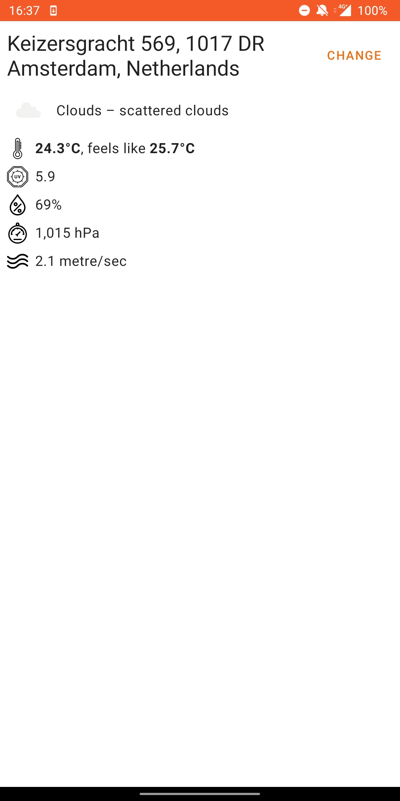
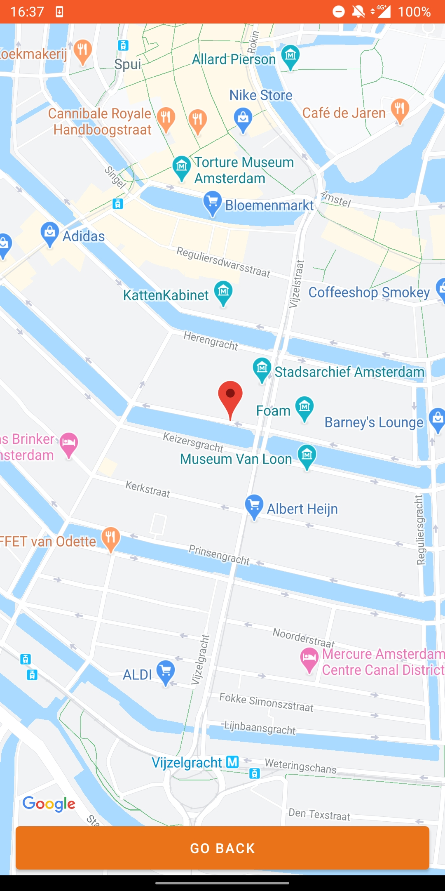
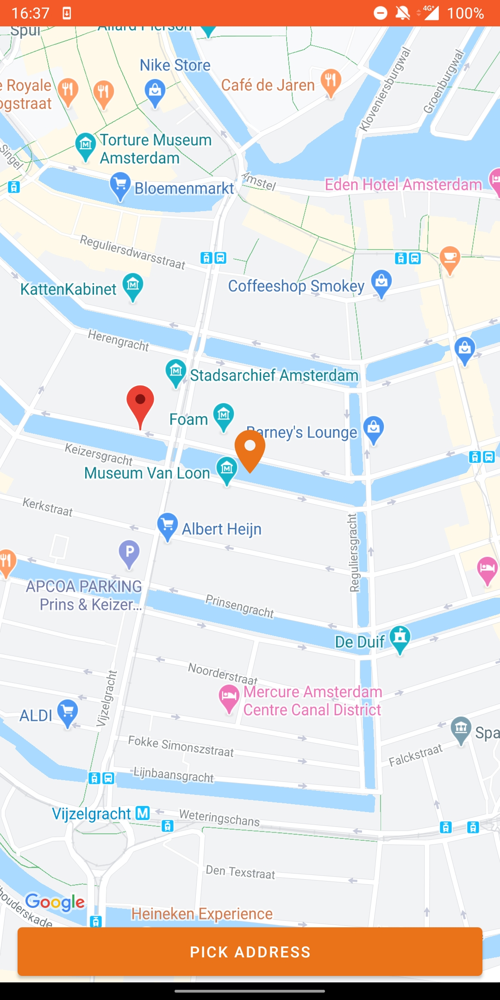

# weatherapp
A simple weather application based on [openweathermap.org](openweathermap.org)

   

# Technologies used
- Kotlin Coroutines
- Hilt
- Android Architecture Components (MVVM, Navigation)
- Coil

# Build
You can download the pre-built apk from [releases page](https://github.com/steelahhh/weatherapp/releases/tag/0.0.1)

Alternatively, when building from source:
- in `local.properties` specify your openweathermap `appid`: ```API_KEY=your_api_key_here```
- in `res/values/google_maps_api.xml` replace `YOUR_KEY` with your actual Google Maps key 
